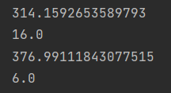
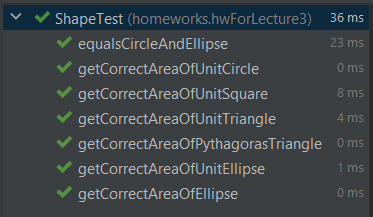

## Homework for lecture 3 (09.07.2021)

**Задание:**
1. Интерфейс Форма, с методом, который будет вычислять площадь
2. Написать Main, который создаёт 4 экземпляра (круг, квадрат, эллипс, треугольник). Классы расширют Форму. В консоль выводить площади
3. Сделать тесты на каждый класс. Минимум несколько тестов для getArea

**Выполнение:**

1. Интерфейс в файле ```Shape.java```

2. Площади
   


3. Тесты

