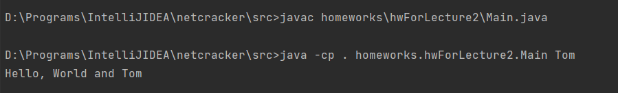

# Main
## Homework from lecture 1 (05.07.2021)

**Задание:**
1. поставить JVM на рабочие машины + IDE (лучше intellij idea все примеры будут на ней )
   https://www.jetbrains.com/ru-ru/idea/download/#section=windows
2. Написать Hello World передать в выходную строчку параметр из аргументов, запустить на установленной IDE, скомпилировать и запустить через javac + java команды

**Выполнение:**

Файл для задания: [```Main.java```](Main.java)

1) Перейти в папку с заданием

2) Компилировать в терминале командой
```javac homeworks\hwForLecture2\Main.java```
   
3) Запускать командой ```java -cp . homeworks.hwFromLecture1.Main something```,
   где ```something``` - какая-нибудь переменная,
   которая будет передана как ```args[0]```
   
