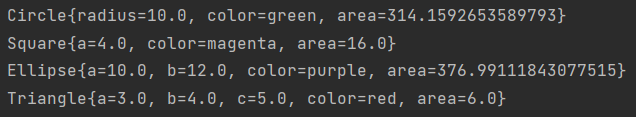
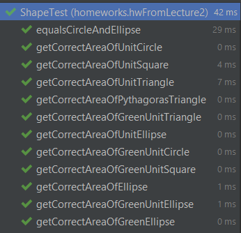

# Shape
## Homework from lecture 2 (07.07.2021)

**Задание:**
* Нужно реализовать 4 типа фигур (квадрат, треугольник, круг, эллипс )
* Интерфейс который должна реализовывать фигура [Shape.java](Shape.java)
* имплементация класса с main функцией, который создает 4 Shape разного типа,
  и на консоль вывести площади всех фигур + тип фигуры
* на каждый класс написать тесты getArea(),
  тестов должно быть больше чем один, зависит от параметров класса
  
**Выполнение:**

1. Интерфейс в файле [```Shape.java```](Shape.java)

2. Площади



3. Тесты

