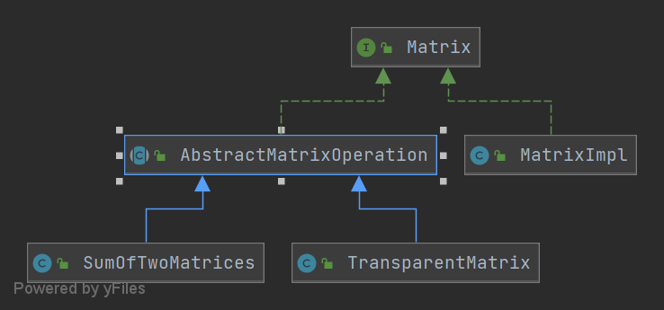
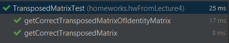
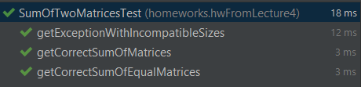
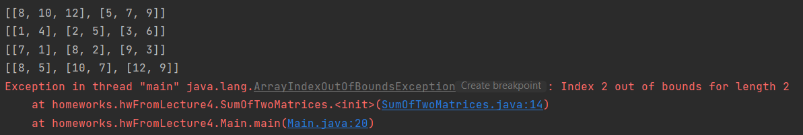

# Decorator

## Homework from lecture 4 (12.07.2021)

### Задание:
[Шаблон Декоратор](https://refactoring.guru/ru/design-patterns/decorator)

* Необходимо реализовать операции над матрицами. Две операции: Транспонирование матрицы и сложение матриц. Каждая операция должно представляться отдельным классом

* Каждая операция должна имплементировать [Matrix](Matrix.java)

* Каждая операция должна быть покрыта тестом (хотя бы одним)

* Необходимо написать класс с функцией main, которая создаст 3 класса (Матрицы, Транспонированную матрицу и затем сложит две матрицы)

* в качестве матрицы нужно использовать [MatrixImpl](MatrixImpl.java)

#### Срок Сдачи
19.07.2021

#### UML в качестве помощи



### Выполнение:

1. Транспонирование реализовано в классе [```TansposedMatrix.java```](TransposedMatrix.java)
   Сложение реализовано в классе [```SumOfTwoMatrices.java```](SumOfTwoMatrices.java)
   
2. Тесты:





3. Что произошло в Main:

