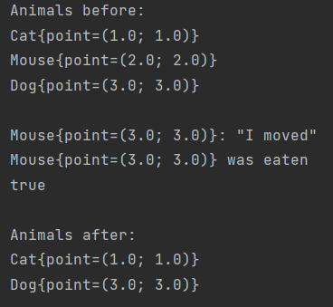

# Tom and Jerry
## Lecture #3 from 09.07.2021

Задание состояло в использовании паттернов Fabric и Composite
на примере зоопарка из персонажей Тома, Джерри и Спайка, где есть 
иерархия, кто кого может есть.

Что произошло в итоге:

